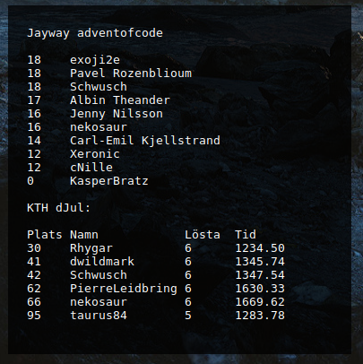

# conky_advent
Conky widget for Advent of Code and dJulkalendern
# Screenshot


**Prerequisites**:
- Python 3.5
- BeautifulSoup4

# Install and run

Install within your home dir (should work in Gnome 3 at least)
```bash
sudo apt-get install conky-all
mkdir -p ~/.conky/conky_advent
git clone --depth=1 https://github.com/Schwusch/conky_advent ~/.conky/conky_advent
cp ~/.conky/conky_advent/conky.desktop ~/.config/autostart/
ln -s ~/.conky/conky_advent/advent.lua ~/.conkyrc
```
## Getting a Session Cookie
You'll need a session cookie from the Advent of Code and djul.datasektionen.se website.

Go to the [Advent of Code Private Leaderboard](http://adventofcode.com/2016/leaderboard/private) page. Make sure you're logged in.
Retrieve the leaderboard # in the url and put it in the script:
```python
ADVENTOFCODE = 'http://adventofcode.com/2016/leaderboard/private/view/YOUR_PRIVATE_LEADERBOARD_NR.json'
```
### In Firefox:
- Open the Developer Tools by pressing `F12`
- Click on the small gear on the top right of the Developer Options pane
- Scroll down and make sure that "Storage" is checked under the Default Firefox Developer Options section
- Click on the Storage tab
- Open the Cookies section and copy the "Value" for "session"
- That value is what you put in place of `PUT_COOKIE_HERE` in the Python script. (e.g. the line will read `ADVENT_COOKIE = {'session': 'THIS_IS_THE_SESSION_COOKIE'}`)

### In Chrome:
- Open the Developer Tools by pressing `CTRL` + `Shift` + `I`
    - Mac: Open the Developer Tools by pressing `Cmd` + `Opt` + `I`
- Select "Aplication" from the tool tabs
- Click the dropdown arrow beside cookies in treeview on the left
- Select *http://adventofcode.com*
- Double click the value of the *session* cookie to highlight it
- Right click and copy the value
- That value is what you put in place of `PUT_COOKIE_HERE` in the Python script. (e.g. the line will read `ADVENT_COOKIE = {'session': 'THIS_IS_THE_SESSION_COOKIE'}`)

Do the same for [dJulkalendern](https://djul.datasektionen.se/), except there are two cookies.

Also, fill in the usernames you want to track from dJulkalendern:
```python
usernames = {"USERNAMES", "TO", "LIST", "HERE"}
```
Start
```
conky -c ~/.conky/conky_advent/advent.lua
```

Stop
```
killall conky
```
